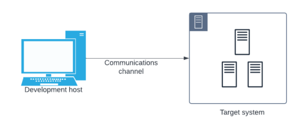
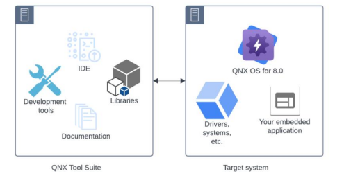

# QNX Training Environment Setup (Simple Guide)

## Overview

This guide explains how to set up a basic environment for QNX training using a host machine and a virtual target system.

---

## Requirements

* QNX account (myQNX)
* QNX Software Center (QSC)
* QNX SDP 8.0
* IDE (QNX Toolkit for VS Code recommended) / QNX Momentics IDE
* Virtual machine software (VMware / VirtualBox)

---

## Setup Steps

1. Create a myQNX account and activate your license
2. Install QNX Software Center
3. Install QNX SDP 8.0
4. Install QNX Toolkit (VS Code extension) or QNX Momentics IDE
5. Set up a virtual machine target (x86_64 recommended)
6. Launch the VM and boot QNX
7. Connect the IDE to the target

---

## Workflow

1. Write code on the host machine
2. Build the project using QNX tools
3. Run the program on the QNX target (VM or hardware)

---

## Alternative Target

* Raspberry Pi  (instead of VM)
we will use Raspberry Pi 5 in the training, but you can also use Raspberry Pi 4 or 3 with QNX support

---

## Training Environment

---

## Notes

* Virtual machines are recommended for easier setup
* Ensure network (DHCP) is enabled in the VM
* Verify QNX Toolkit configuration

---

you can find more detailed instuctions in the official QNX guide 
[QNX Training Environment Setup Guide](classroom-environment-guide-for-qnx-training-1767968686.pdf)

and the excercises for the training in the official QNX guide
[QNX Training Excercises Guide](real_time_programming_for_qnx_os_course_exercises/)

## Summary

Develop on your computer → run on QNX target (VM or device)

---