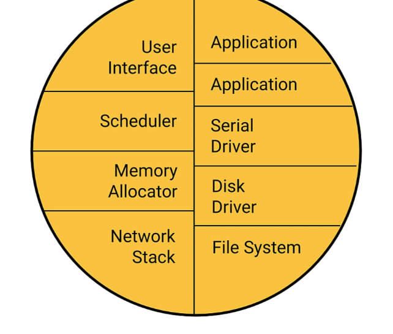
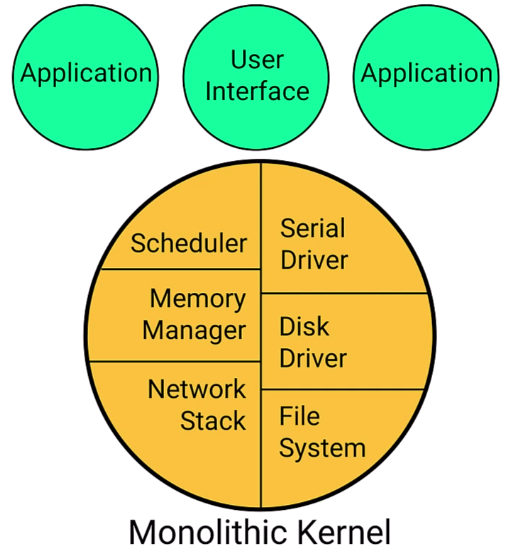
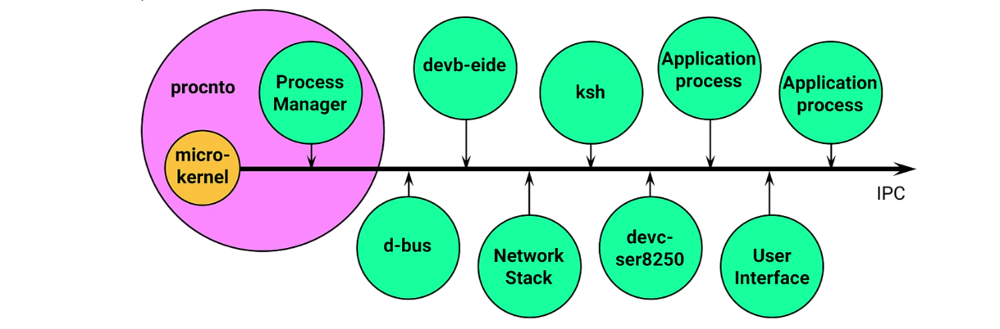
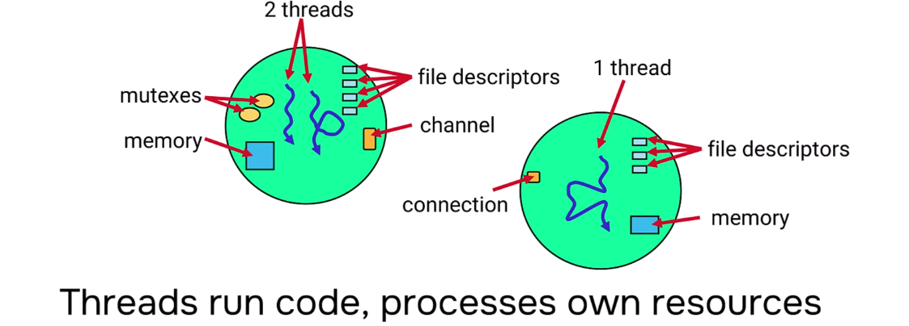

# QNX Architecture Overview

## Primary Goals

- **POSIX API Delivery** — QNX implements POSIX standards for threads, signals, and timers
- **Portability** — Achieved through POSIX compliance
- **Language Support** — C/C++ with GNU compiler toolchain (gcc)

> Note: While QNX uses POSIX APIs, its underlying implementation is completely different from traditional UNIX systems.

---

## Architecture Comparison

### 1. Traditional Real-Time Executive

- Everything resides **inside the kernel** (user processes, drivers, applications)
- Simple architecture with no context switches
- Uses memory pointers for communication
- **Problem:** If one component fails, the entire kernel crashes

### 2. Traditional Monolithic (UNIX-style)

- User applications moved **outside the kernel** with separate address spaces
- Drivers still share kernel address space
- **Problem:** Driver bugs can still crash the kernel
- Difficult to develop and debug drivers

### 3. QNX Microkernel Architecture

- **Everything is a separate process**, including drivers
- All processes have their **own address spaces**
- Kernel and Process Manager share one address space (called **procnto**)
- If a process crashes, **the kernel remains unaffected**
- Drivers are easy to develop, debug, and scale

---

## What is procnto?

**procnto** = Process Manager + Neutrino Microkernel

| Component | Responsibility | How to Reach |
|-----------|----------------|--------------|
| **Neutrino (Microkernel)** | Thread scheduling, IPC mechanisms | Kernel calls |
| **Process Manager** | Process creation, management, memory handling | Message passing (IPC) |

- `proc` = Process Manager
- `nto` = Neutrino (microkernel name)
- **Process ID 1** — First process running on the system

---

## Interprocess Communication (IPC)

Processes communicate using various IPC methods:

- Message Passing
- Pulses
- Message Queues
- Shared Memory

**Example Use Cases:**
- D-Bus sending config to a driver process
- Application writing data to serial port
- Process-to-process data transfer

---

## Example Processes in QNX

| Process | Description |
|---------|-------------|
| `devc-con` | Console driver |
| `pci-server` | PCI bus manager |
| `io-sock` | Network socket process |
| `qconn` | IDE communication agent |
| `devc-pty` | Pseudo-terminal driver |
| `pipe`, `random` | System utilities |

> All drivers are normal processes with separate address spaces from the kernel.

---

## Benefits of QNX Architecture

| Benefit | Description |
|---------|-------------|
| **Robustness** | Process failures don't crash the kernel |
| **Resilience** | System can recover from failures |
| **Easy Development** | Drivers compiled as normal applications |
| **Scalability** | Add/remove drivers on running systems |
| **Easy Debugging** | Debug drivers like regular programs |

## Trade-offs

- More context switches due to IPC
- Data copies between processes
- Slight system overhead

---

## Processes

A **process** is a program loaded into memory.

### Process Characteristics:
- Identified by **Process ID (PID)**
- Owns resources provided to threads:
  - Memory
  - Code and Data
  - Timers
  - User ID / Group ID (security)
  - Abilities/capabilities
- Resources are **protected and not shared** (except shared memory)

---

## Threads

A **thread** is the execution unit within a process.

### Thread Characteristics:
- Provides **single flow of code execution**
- Identified by **Thread ID (TID)** — unique within a process only
- Process local (TIDs may repeat across different processes)

### Thread Attributes:
| Attribute | Description |
|-----------|-------------|
| Priority | Execution priority level |
| Scheduling | FIFO, Round-Robin, etc. |
| CPU Mask | Core affinity for multi-core systems |
| Signal Mask | Blocked signals |
| Stack | Custom stack allocation |

---

## Processes vs Threads Summary

| Aspect | Process | Thread |
|--------|---------|--------|
| **Role** | Building block, visible to other processes | Hidden implementation detail |
| **Resources** | Owns and provides resources | Uses process resources |
| **Communication** | IPC with other processes | Shares resources within process |
| **Identification** | PID (system-wide unique) | TID (process-local) |
| **Requirement** | Must have at least one thread | Runs within a process |

### Key Points:
- A **live process** requires at least one running thread
- Processes can be **single-threaded** or **multi-threaded**
- Multiple threads share process resources
- Use **synchronization** (mutex, condition variables) when threads share resources

---

> *Processes are what you see running. Threads are what actually execute the code.*