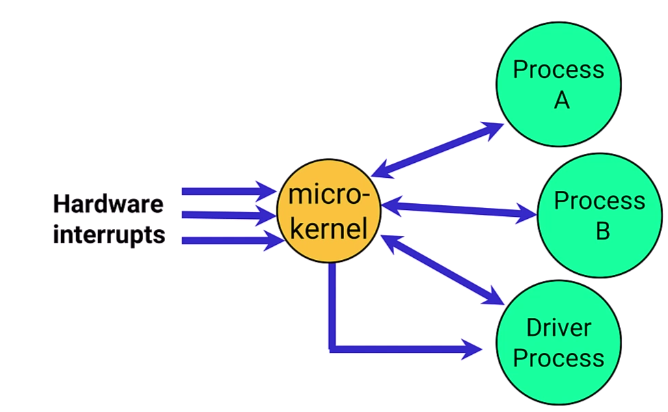
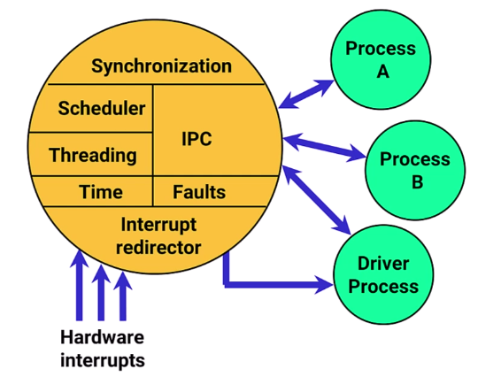
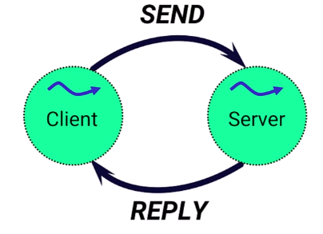
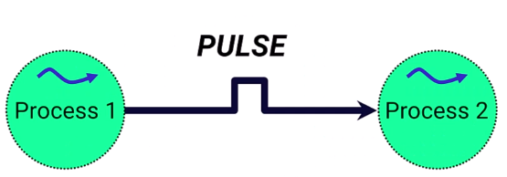
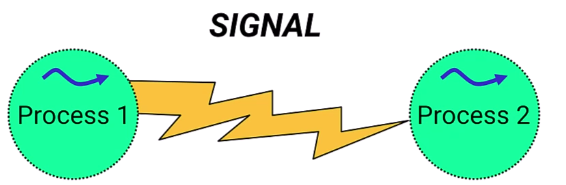
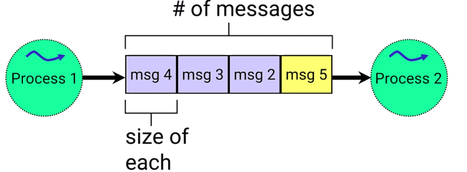
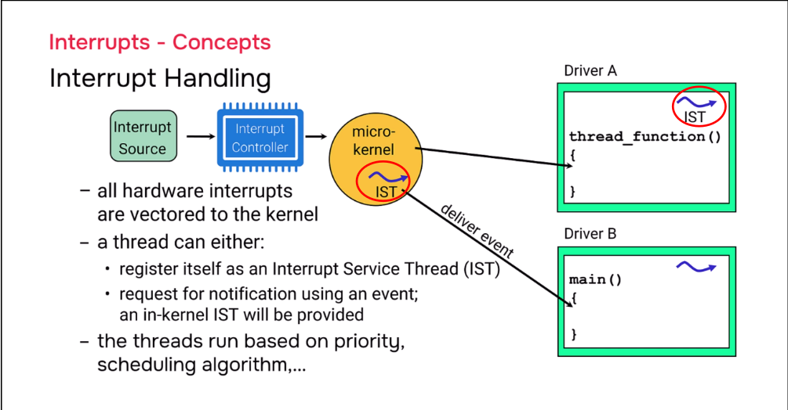

# QNX Microkernel

## Overview

The **microkernel** is the heart of the QNX system. It is responsible for: 
- Handling hardware interrupts and passing them to applications
- Managing all interprocess communication (IPC) between processes

---

## Kernel Calls

Programs interact with the microkernel through **kernel calls** — special library routines that execute code in the microkernel.

### Recognizing Kernel Calls:
- Written in **camelCase** with uppercase letters
- Examples: `MsgSend()`, `ThreadCreate()`, `TimerCreate()`

---

## What Happens During a Kernel Call?

When a thread makes a kernel call:

| Change | Description |
|--------|-------------|
| **Privilege Level** | Switches from user-level to kernel-level privileges |
| **Address Space** | procnto address space becomes visible |
| **Stack** | Switches to kernel space stack |
| **Thread Identity** | Remains the same thread with same priority |
| **Preemption** | Can still be preempted or interrupted |

> Making a kernel call is similar to calling a normal library function.

<strong>📖 More Details</strong>

## Overview

When a thread makes a kernel call (like `MsgSend()`), it transitions from user mode to kernel mode. The **same thread** continues running — it just executes kernel code instead of user code.

**Key Point:** No kernel thread takes over. Your thread does the work itself with elevated privileges.

---

## What Changes During a Kernel Call

| Aspect | Before | After |
|--------|--------|-------|
| Privilege Level | User level | Kernel level |
| Visible Address Space | Process only (/proc/PID/) | Process + procnto |
| Stack in Use | User stack | Kernel stack |
| Code Executing | Your application code | Microkernel code |
| Privilege Level | User level | Kernel level |
| Visible Address Space | Process only (`/proc/PID/`) | Process + procnto |
| Stack in Use | User stack | Kernel stack |
| Code Executing | Your application code | Microkernel code |

---

## What Stays the Same

| Aspect | Value |
|--------|-------|
| Thread Running | Same thread |
| Thread ID (TID) | Unchanged |
| Thread Owner | Same process |
| Thread Priority | Unchanged |
| Scheduling Algorithm | Unchanged |
| Can Be Preempted | Yes |

---

## Scenario Example

**Setup:**
- Process: `myprocess` (PID: 1234)
- Thread: `mythread` (TID: 1)
- Action: Calls `MsgSend("Hello")`

**What Happens:**
mythread runs user code

        │
        ▼

MsgSend("Hello") called

        │
        ▼

Privilege elevates to kernel level
Stack switches to kernel stack
procnto address space becomes visible

        │
        ▼

Kernel code executes (STILL mythread!)

        │
        ▼

Operation completes

        │
        ▼

Returns to user mode
mythread continues user code

---

## Does the Kernel Run or Stay Idle?

**Answer:** Kernel CODE runs, kernel THREADS stay idle.

| Component | Status During MsgSend() |
|-----------|-------------------------|
| Kernel Code | ✅ Running (inside mythread) |
| IPI IST | 💤 Idle |
| Timer IST | 💤 Idle |
| Idle Thread | 💤 Idle |

The microkernel is **externally driven** — it runs inside your thread, not separately.

---

## When Do Kernel Threads Actually Run?

| Kernel Thread | Runs When |
|---------------|-----------|
| IPI IST | Another CPU core sends inter-processor interrupt |
| Timer IST | Hardware timer fires an interrupt |
| Idle Thread | No other threads need to run |

---

## Quick Reference

| Question | Answer |
|----------|--------|
| What thread runs during kernel call? | Your thread |
| Does a kernel thread take over? | No |
| Does privilege level change? | Yes (user → kernel) |
| Does stack change? | Yes (user → kernel stack) |
| Does thread priority change? | No |
| Can thread be preempted? | Yes |
| Does kernel code execute? | Yes |
| Do kernel threads run? | No (they stay idle) |

---

> *Kernel calls let your thread temporarily "borrow" kernel privileges to execute microkernel code. The kernel's dedicated threads remain asleep unless their specific events occur.*

---

## Microkernel Characteristics

- **Externally driven** — Maintains state of kernel objects (threads, etc.)
- Updates state based on:
  - Kernel calls
  - Interrupts
  - Faults

### Microkernel Threads (per CPU core):

| Thread | Purpose |
|--------|---------|
| **IPI IST** | Handles Interprocess Interrupts (core-to-core communication) |
| **Timer IST** | Manages timer interrupts and activities |
| **Idle Thread** | Runs when no other threads are active |

> IST -> Interrupt Service Thread

---

## Microkernel Components

The microkernel provides:
- **Synchronization Primitives** — Thread coordination
- **Scheduler** — Thread execution management
- **Time Services** — Access time of day, set timers
- **Interrupt Redirector** — Routes hardware interrupts to handling processes
- **Fault Handler** — Handles divide-by-zero, segfaults, etc.
- **Interprocess Communication (IPC)**

---

## Interprocess Communication (IPC) Methods

### 1. Native QNX Messages

| Aspect | Description | 
|--------|-------------|
| Type | **Synchronous** (blocking) |
| Flow | Client sends → Server processes → Server replies |
| Behavior | Client waits until server completes and replies |

### 2. Pulses

| Aspect | Description |
|--------|-------------|
| Type | **Asynchronous** (non-blocking) |
| Purpose | Notify another process that something occurred |
| Use Case | Data arrival notification in device drivers |

### 3. POSIX Signals

| Aspect | Description |
|--------|-------------|
| Purpose | Interrupt another process |
| Common Use | Process termination (`SIGKILL`, `SIGTERM`) |
| Note | Heavyweight; not recommended unless porting POSIX code |

### 4. POSIX Message Queues

| Aspect | Description |
|--------|-------------|
| Purpose | Queue fixed-size messages between processes |
| Analogy | Similar to a mailbox |
| Flow | Process 1 sends → Messages queue → Process 2 pulls and processes |

---

## Thread Functions

The microkernel provides:

- **Create and terminate** threads
- **Wait for thread completion** — Read status or get execution results
- **Change thread attributes**

---

## Thread Synchronization Methods

| Method | Purpose |
|--------|---------|
| **Mutex** | Ensures only one thread accesses a code section at a time |
| **Condvar (Condition Variable)** | Producer/consumer synchronization |
| **Semaphore** | Wait on a counter |
| **Barrier** | Wait for multiple threads to reach a point before continuing |
| **RWLock (Read/Write Lock)** | Separate locks for read vs write operations |

---

## Time Services

### Two Major Types:

| Type | Description |
|------|-------------|
| **Time of Day** | Get current time using hardware free-running counters |
| **Timers** | Notify application when specific time has passed |

**Timer Example:** Set a 500ms timer to check if a buffer has data; if not, go back to sleep.

---

## Interrupt Handling

All hardware interrupts go to the microkernel first.

### Two Delivery Methods:

| Method | Description |
|--------|-------------|
| **Interrupt Service Thread (IST)** | Thread registers as IST; microkernel delivers interrupt directly |
| **Event Firing** | Microkernel IST delivers event to waiting thread |

> Both methods still follow thread priority and scheduling algorithms.

---

## When Does the Microkernel Run?

| Trigger | Description |
|---------|-------------|
| **Kernel Call** | Application explicitly calls a microkernel function |
| **Interrupt** | Hardware interrupt triggers microkernel |
| **Fault/Exception** | Processor encounters an error (divide-by-zero, etc.) |

### Where Does It Run?

The microkernel runs on the core where:
- The kernel call was made
- The interrupt was directed
- The fault occurred

---

## Summary

| Component | Role |
|-----------|------|
| **Microkernel** | Core of QNX; handles IPC, interrupts, scheduling |
| **Kernel Calls** | Interface for applications to use microkernel services |
| **IPC Methods** | Messages, Pulses, Signals, Message Queues |
| **Synchronization** | Mutex, Condvar, Semaphore, Barrier, RWLock |
| **Time Services** | Time of day access, timers |
| **Interrupt Handling** | Routes interrupts to appropriate threads/processes |

---

> *The microkernel is externally driven, lightweight, and provides the foundation for QNX's reliability and real-time performance.*