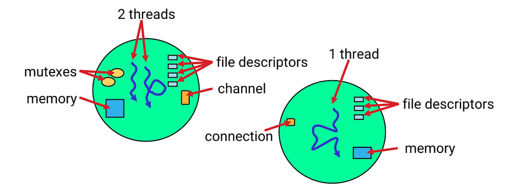
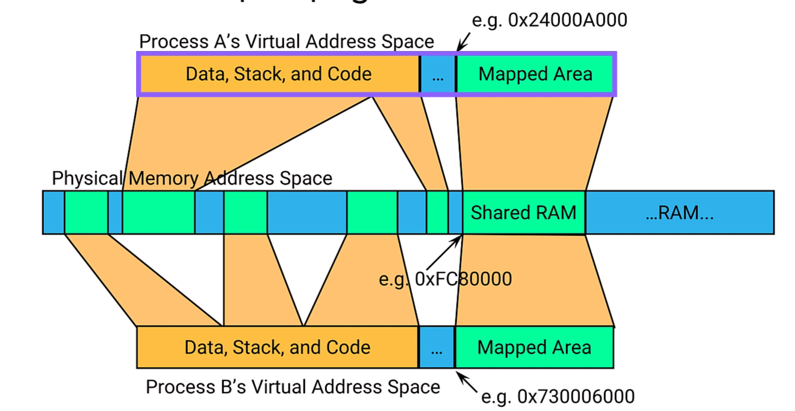

# QNX Process Manager

## Overview

The Process Manager is part of **procnto** (proc = Process Manager, nto = Neutrino microkernel). Both components share the same address space but are very different in behavior.

**Key Point:** Applications communicate with the Process Manager through **messages**. Many C APIs (like `open()`) hide these messages underneath.

---

## Process Manager Responsibilities


| Responsibility | Description |
|----------------|-------------|
| **Process Management** | Create, terminate, spawn, fork, exec, load processes |
| **Thread Packaging** | Groups all threads belonging to a process |
| **Memory Management** | Allocates and manages virtual address spaces |
| **Shared Memory** | Maps shared memory between processes |
| **Path Name Management** | Controls the entire path namespace (unique to QNX) |
| **System Notifications** | Provides system state change notifications |

---

## Memory Management

### Virtual Address Model

Each process has its own **unique virtual address space** — its view of the system.

**What's in a process's virtual address space:**
- Memory allocated to the process
- Shared memory (if requested)
- Kernel-managed areas

### How Memory Mapping Works

The Process Manager handles all virtual-to-physical address mapping through `mmap()` calls.

**Example: Accessing Hardware**

```c
// Need to access hardware at physical address 0x1000000
void *ptr = mmap(NULL, size, PROT_READ|PROT_WRITE, MAP_PHYS, NOFD, 0x1000000);
// Process Manager maps physical address to your virtual address space
// Returns a pointer you can use in YOUR address space
```

### Memory Layout



**Key Points:**
- Same shared memory appears at **different virtual addresses** in different processes
- Process Manager can provide **contiguous virtual memory** even if physical memory is fragmented
- Kernel address space is above 512GB (separate from user processes)

---

## Path Name Management

This is a **unique and important concept** in QNX that differs from other operating systems.

### How It Works

1. At system startup, only `/` (root) exists — controlled by Process Manager
2. Resource managers register to handle specific paths
3. When you access a path, Process Manager finds the **most specific match**
4. Request is redirected to the appropriate resource manager

### Process Manager's Own Resource Managers

| Path | Purpose |
|------|---------|
| `/proc` | View of all running processes |
| `/dev/shmem` | Shared memory blocks |
| `/dev/sem` | System semaphores |

---

## Path Resolution Examples

### System Setup

Imagine this system configuration:

```
procnto-smp-instr    →  /           (fallback, root)
devb-eide            →  /           (disk driver, handles files)
devc-con             →  /dev/con    (console driver)
devc-ser8250         →  /dev/ser1   (serial port driver)
io-pkt               →  /dev/socket (network stack)
```

### Example 1: Opening Console

**Application calls:** `open("/dev/con1", O_RDWR)`

**Resolution:**
1. Process Manager receives request for `/dev/con1`
2. Searches registered paths for best match
3. Finds `/dev/con` registered by `devc-con`
4. `/dev/con` is more specific than `/`
5. Request redirected to console driver
6. Console driver handles the open

### Example 2: Opening Serial Port

**Application calls:** `open("/dev/ser1", O_RDWR)`

**Resolution:**
1. Process Manager receives request for `/dev/ser1`
2. Searches registered paths
3. Finds `/dev/ser1` registered by `devc-ser8250`
4. Exact match found
5. Request redirected to serial driver

### Example 3: Opening a File

**Application calls:** `open("/etc/passwd", O_RDONLY)`

**Resolution:**
1. Process Manager receives request for `/etc/passwd`
2. Searches registered paths
3. No specific match for `/etc` or `/etc/passwd`
4. Falls back to `/` registered by `devb-eide` (disk driver)
5. Disk driver handles the file access

### Example 4: Listing Processes

**Application calls:** `opendir("/proc")`

**Resolution:**
1. Process Manager receives request for `/proc`
2. `/proc` is handled by Process Manager itself
3. Returns directory listing of all running processes (as PIDs)

### Example 5: Network Socket

**Application calls:** `open("/dev/socket", ...)`

**Resolution:**
1. Process Manager receives request
2. Finds `/dev/socket` registered by `io-pkt`
3. Request redirected to network stack

---

## Visual: Path Resolution Flow

```
Application: open("/dev/ser1", ...)
       │
       ▼
┌─────────────────────────────┐
│     Process Manager         │
│                             │
│  Registered Paths:          │
│  ┌────────────────────────┐ │
│  │ /dev/con    → devc-con │ │
│  │ /dev/ser1   → devc-ser │◄── Best match!
│  │ /dev/socket → io-pkt   │ │
│  │ /           → devb-eide│ │
│  └────────────────────────┘ │
└─────────────────────────────┘
       │
       ▼
Request sent to devc-ser8250
```

---

## Comparison: QNX vs Traditional OS

| Aspect | Traditional OS (Linux) | QNX |
|--------|------------------------|-----|
| Path handling | Kernel handles VFS | Process Manager routes to resource managers |
| Device access | Through `/dev` with kernel drivers | Through paths handled by user-space processes |
| Adding devices | Load kernel module | Start resource manager process |
| Mount points | Explicit mount commands | Automatic path registration |

### Integrated View

When you run `ls /` on QNX, you see a **unified directory tree** that combines:
- Files from disk driver
- Pseudo-files from Process Manager (`/proc`)
- Device entries from various drivers
- Network paths from network stack

All seamlessly integrated by the Process Manager's path name management.

---

## Key Takeaways

1. **Process Manager handles memory** — virtual address mapping, shared memory, physical access
2. **Path namespace is centralized** — Process Manager controls all path resolution
3. **Most specific match wins** — `/dev/ser1` beats `/dev` beats `/`
4. **Resource managers are user-space** — drivers register paths and handle requests
5. **Unified view** — all paths appear as one directory tree to applications

---

> *The Process Manager is the central coordinator for processes, memory, and the entire path namespace in QNX.*